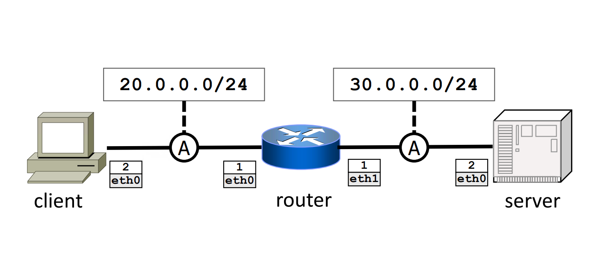

# Base Scenario
This is a simple network scenario to show the basic usage of the [TRex ASTF API](https://trex-tgn.cisco.com/trex/doc/cp_astf_docs/api/index.html) 
when the TRex server and client are deployed separately. 

This is the network topology:


The server node run the TRex server, while the client node run the TRex client. 

The goal is to generate `http` traffic between the nodes. 
To do so we use the [http_simple.py](https://github.com/cisco-system-traffic-generator/trex-core/blob/master/scripts/astf/http_simple.py) example profile.

The client should start to send http request from network `16.0.0.0/24` to network `48.0.0.0/16`, hence devices are 
configured with the proper routes. 

## Network Scenario Configuration
The `lab` folder contains all the files needed by Kathará to run the emulation:
- `lab.conf` contains the network topology configuration. You can find more details on it on the [man-pages](https://www.kathara.org/man-pages/kathara-lab.conf.5.html).
- `*.startup` files contain the commands executed at devices startup.
- The folders with devices' names contains file and configurations that are copied (in the same paths) into devices at startup (e.g., trex configurations). 

## Running the Scenario 
To run the example you only need to enter the lab folder, starting Kathará: 
```shell
cd lab
sudo kathara lstart --privileged 
```
**N.B.**: `--privileged` is required by the TRex Docker container to work properly.  

Since devices start TRex at the startup, we can connect to the server and run the trex script to load the profile and 
to wait the client:
```shell
kathara connect server
python3 /start_trex_server.py
```

Now, we can connect to the client and run the client script:
```shell
kathara connect client
python3 /start_trex_client.py
```

In this way the client starts to generate `http get` requests towards the server, for 10 seconds. 

You can log into the router and dump the traffic:
```shell
kathara connect router
tcpdump -tenni eth0 
```

You can also save the pcap into the `shared` directory in the `lab` to access it directly from the host: 
```shell
tcpdump -i eth0 -w /shared/router.pcap 
```