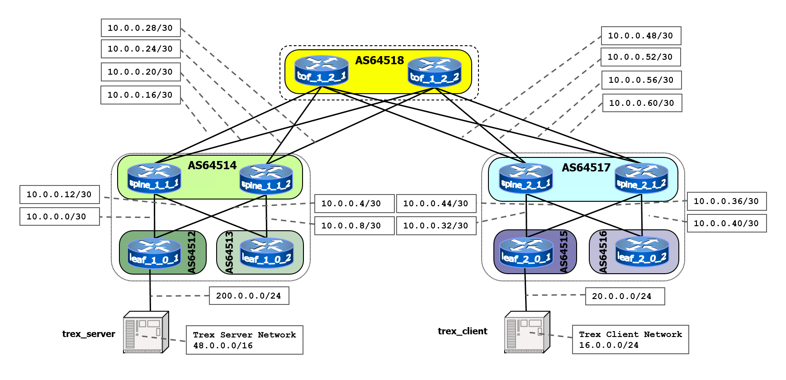

# Simple Fat-Tree
A network scenario to test the data-plane of a simple fat-tree data center composed of two pods and ten switches.

The fat-tree uses a BGP control-plane implemented using [FRRouting](http://docs.frrouting.org/en/stable-7.5/bgp.html) to exchange routes among nodes. 

The network scenario is generated and configured using the [VFTGen](https://github.com/KatharaFramework/VFTGen) tool,
and then modified to use TRex for testing the data-plane.



Tee left PoD contains the TRex server attached to `leaf_1_0_1`. While the second PoD, that acts as exit PoD, is attached
through `leaf_2_0_1` to the TRex client. 

The goal is to generate `http` requests from the TRex client node outside the data center towards the TRex server. 
To generate the traffic we use the [http_simple.py](https://github.com/cisco-system-traffic-generator/trex-core/blob/master/scripts/astf/http_simple.py)
example profile. 

The client sends http request from network `16.0.0.0/24` to network `48.0.0.0/16`, hence devices are 
configured with the proper routes (see `*.startup` files for details):
- `leaf_1_0_1` announces the TRex server's network `48.0.0.0/16` in BGP;
- `leaf_2_0_1` announces the TRex client's network `16.0.0.0/24` in BGP; 
- `leaf_2_0_1` is connected to the TRex client using a static route.  

## Network Scenario Configuration
The `lab` folder contains all the files needed by Kathará to run the emulation:
- `lab.conf` contains the network topology configuration. You can find more details on it on the [man-pages](https://www.kathara.org/man-pages/kathara-lab.conf.5.html).
- `*.startup` files contain the commands executed at devices startup (e.g., interfaces configuration).
- The folders with devices' names contains file and configurations that are copied (in the same paths) into devices at startup (e.g., trex configurations). 

## Running the Scenario 
To run the example you only need to enter the lab folder, starting Kathará: 
```shell
cd lab
sudo kathara lstart --privileged 
```
**N.B.**: `--privileged` is required by the TRex Docker container to work properly.  

The startup commands of both client and server specifies to start the trex server process (`./t-rex-64 --astf -i`).  
So, you can log into the server and directly run the trex script to load the traffic profile and
to wait for the client requests. To do so, open a new terminal and type:
```shell
kathara connect trex_server
```

You logged into the server! To run the script, type:
```shell
python3 /start_trex_server.py
```
At this point, the server waits to receive the client requests.
Open a new terminal to connect to the client:
```shell
kathara connect trex_client
```
Then, to run the client script:
```shell
python3 /start_trex_client.py
```
In this way the client starts to generate `http get` requests towards the server, for 60 seconds. 

To verify it, open a new terminal to log into `leaf_1_0_1` and dump the traffic:
```shell
kathara connect leaf_1_0_1 
```
Dump one of the router's interfaces:
```shell
tcpdump -tenni eth2
```

You should see something like this:
```shell
7a:05:6f:b7:99:82 > 12:21:c2:aa:14:ee, ethertype IPv4 (0x0800), length 315: 16.0.0.60.19987 > 48.0.0.60.80: Flags [P.], seq 1:250, ack 1, win 32768, options [nop,nop,TS val 1804408615 ecr 1681862917], length 249: HTTP: GET /3384 HTTP/1.1
12:21:c2:aa:14:ee > 7a:05:6f:b7:99:82, ethertype IPv4 (0x0800), length 1514: 48.0.0.60.80 > 16.0.0.60.19987: Flags [.], seq 1:1449, ack 250, win 32768, options [nop,nop,TS val 1681862918 ecr 1804408615], length 1448: HTTP: HTTP/1.1 200 OK
12:21:c2:aa:14:ee > 7a:05:6f:b7:99:82, ethertype IPv4 (0x0800), length 1514: 48.0.0.60.80 > 16.0.0.60.19987: Flags [.], seq 1449:2897, ack 250, win 32768, options [nop,nop,TS val 1681862918 ecr 1804408615], length 1448: HTTP
12:21:c2:aa:14:ee > 7a:05:6f:b7:99:82, ethertype IPv4 (0x0800), length 1514: 48.0.0.60.80 > 16.0.0.60.19987: Flags [.], seq 2897:4345, ack 250, win 32768, options [nop,nop,TS val 1681862918 ecr 1804408615], length 1448: HTTP
12:21:c2:aa:14:ee > 7a:05:6f:b7:99:82, ethertype IPv4 (0x0800), length 1514: 48.0.0.60.80 > 16.0.0.60.19987: Flags [.], seq 4345:5793, ack 250, win 32768, options [nop,nop,TS val 1681862918 ecr 1804408615], length 1448: HTTP
12:21:c2:aa:14:ee > 7a:05:6f:b7:99:82, ethertype IPv4 (0x0800), length 1514: 48.0.0.60.80 > 16.0.0.60.19987: Flags [.], seq 5793:7241, ack 250, win 32768, options [nop,nop,TS val 1681862918 ecr 1804408615], length 1448: HTTP
12:21:c2:aa:14:ee > 7a:05:6f:b7:99:82, ethertype IPv4 (0x0800), length 1514: 48.0.0.60.80 > 16.0.0.60.19987: Flags [.], seq 7241:8689, ack 250, win 32768, options [nop,nop,TS val 1681862918 ecr 1804408615], length 1448: HTTP
12:21:c2:aa:14:ee > 7a:05:6f:b7:99:82, ethertype IPv4 (0x0800), length 1514: 48.0.0.60.80 > 16.0.0.60.19987: Flags [.], seq 8689:10137, ack 250, win 32768, options [nop,nop,TS val 1681862918 ecr 1804408615], length 1448: HTTP
12:21:c2:aa:14:ee > 7a:05:6f:b7:99:82, ethertype IPv4 (0x0800), length 1514: 48.0.0.60.80 > 16.0.0.60.19987: Flags [.], seq 10137:11585, ack 250, win 32768, options [nop,nop,TS val 1681862918 ecr 1804408615], length 1448: HTTP
12:21:c2:aa:14:ee > 7a:05:6f:b7:99:82, ethertype IPv4 (0x0800), length 1514: 48.0.0.60.80 > 16.0.0.60.19987: Flags [.], seq 11585:13033, ack 250, win 32768, options [nop,nop,TS val 1681862918 ecr 1804408615], length 1448: HTTP
12:21:c2:aa:14:ee > 7a:05:6f:b7:99:82, ethertype IPv4 (0x0800), length 1514: 48.0.0.60.80 > 16.0.0.60.19987: Flags [.], seq 13033:14481, ack 250, win 32768, options [nop,nop,TS val 1681862918 ecr 1804408615], length 1448: HTTP
```

You can also save the pcap into the `shared` directory in the `lab` to access it directly from the host: 
```shell
tcpdump -i eth2 -w /shared/leaf_1_0_1.pcap 
```
You can now open the `.pcap` file on your host (e.g., using [Wireshark](https://www.wireshark.org/)) to inspect the exchanged traffic.